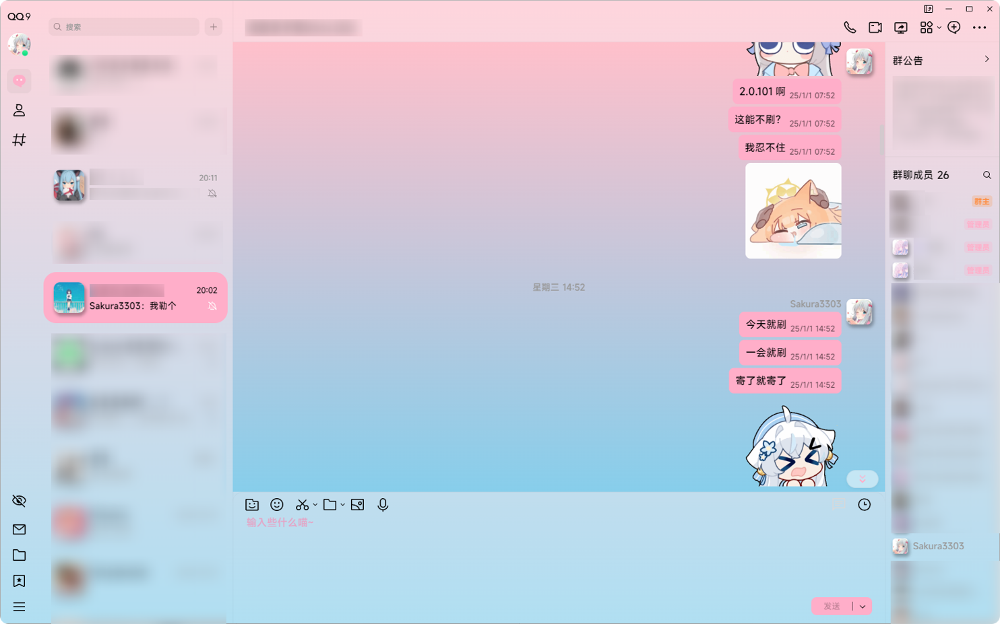

# Rounded_Avatar_for_QQNT

在QQNT中圆角化用户头像，使用LiteLoaderQQNT的Transitio插件实现


## 插件效果




## 自定义圆角

```css
.avatar[data-v-4eb71541],.avatar[data-v-2e5b973a] {
    /* 用户头像圆角控制 */
    border-radius: 21%;
     /*用户头像阴影控制  */
    box-shadow: 2px 4px 5px 1px rgba(0, 0, 0, 0.3);
}
```

**border-radius** 后面的值控制头像圆角弧度，50%为圆。默认为21%，如果你不喜欢可以修改。如果只希望分别设置不同角的圆角弧度，可以这样写`border-radius: 0% 21% 0% 21%;` 即左上和右下角为直角，右上和左下角为圆角。

**box-shadow** 负责控制头像阴影，如果不喜欢可以将这一行代码更改为` /* box-shadow: 2px 4px 5px 1px rgba(0, 0, 0, 0.3); */`。其中，这些值依次为x轴偏移量 y轴偏移量 模糊半径 扩散半径 阴影颜色

<br>


~~**CSS新手，GitHub新手 我知道自己写的烂（**~~
